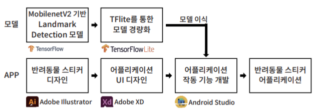
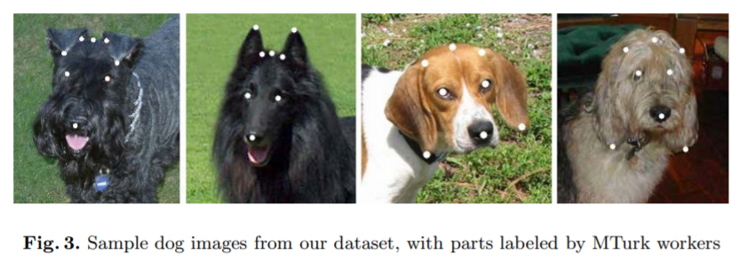
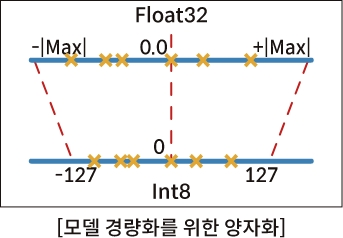
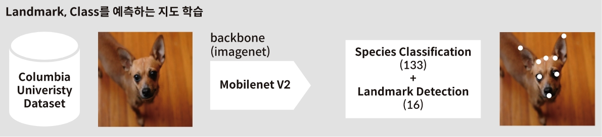
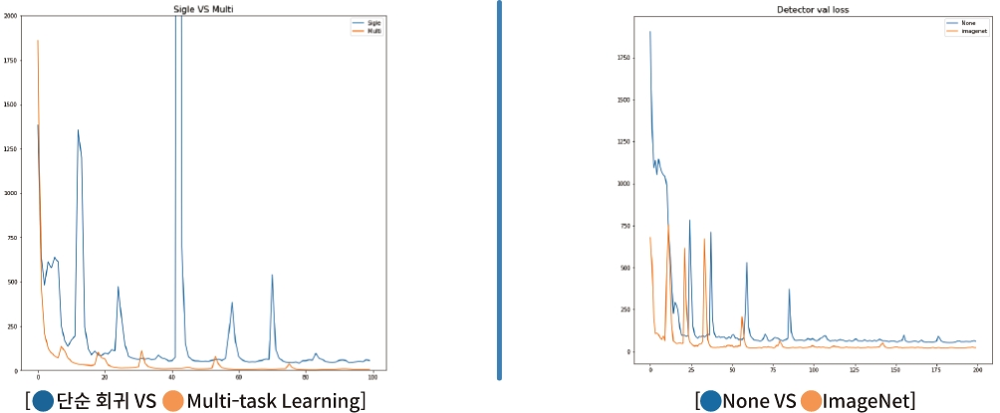
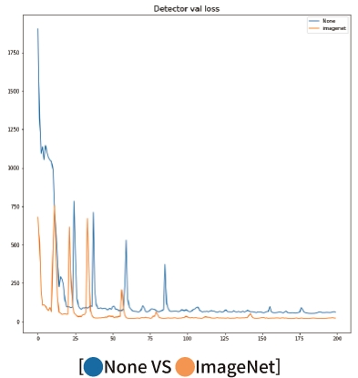
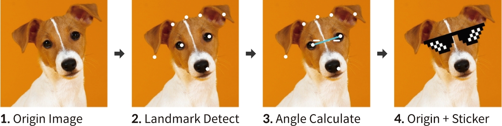
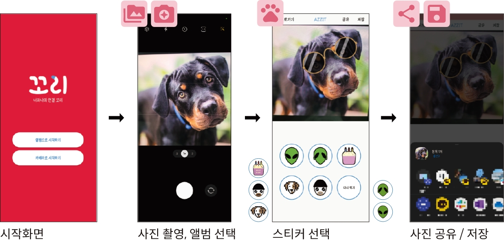

# 광운대학교 산학연계 SW 프로젝트

 

### 😁 AZZIT 팀 : 정진우, 김종민, 이주완, 최지욱   
### 지도교수 : 이상민 교수님   
### 연계 회사 : (주) 꼬리 

## 프로젝트 개요    

  * 모델   
    - mobilenetV2 기반의 Landmark Detection model
    - Imagenet에 Pretrained된 weight 사용
    - 데이터 셋 : [CU-Dataset](https://link.springer.com/chapter/10.1007/978-3-642-33718-5_13)
      - 133 breed, about 8,000 images
      - BB-box, 8개 Landmark annotate
      
           
      image from [Dog Breed Classification Using Part Localization](https://link.springer.com/chapter/10.1007/978-3-642-33718-5_13)

    - 경량화 : TF-Lite의 양자화 기법 사용 \
     
  * 애플리케이션
    * android 애플리케이션 개발
    * android studio 사용
## 모델 학습

  -  [CU-Dataset](https://link.springer.com/chapter/10.1007/978-3-642-33718-5_13)을 이용한 모델 학습
  -  8개의 Landmark point를 regression
  -  성능 향상을 위해 종 분류를 추가해, multi-task learning 기법 사용
     
  - 학습 결과 \
     
     <!--  -->
## 애플리케이션 구현

  - 각도 조절
    - ⫯ input image를 전달받으면, ⫯ 어플리케이션 내의 TF-Lite모델이 landmark detection함. ⫯ 눈의 기울어진 각도를 찾기 위해서 angle calculate 진행, ⫯ 계산된 각도를 이용하여 input image에 sticker를 입힌 output 제공.
     
  - 실제 화면
     